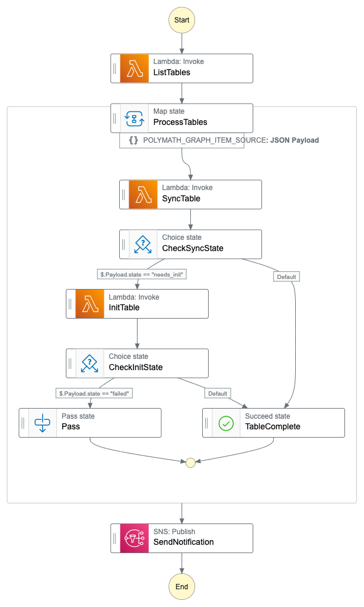

# canvas-data-2-aws - WORK IN PROGRESS

This project contains source code and supporting files for a serverless application that you can use to download and maintain a Canvas Data 2 replica database.
You can deploy this application to your AWS account with the SAM CLI. It includes the following files and folders.

- `list_tables` - Code for a Lambda function that fetches the list of CD2 tables using the `dap` client library.
- `sync_table` - Code for a Lambda function that syncs a table using the `dap` client library.
- `init_table` - Code for a Lambda function that inits a table using the `dap` client library.
- `template.yaml` - A template that defines the application's AWS resources.

This application uses an AWS Step Function to orchestrate the workflow:



## Application workflow

1. The Step Function is executed on an hourly schedule via EventBridge.
2. The first step executes the `list_tables` Lambda functions which retrieves the list of CD2 tables from the API.
3. The list of tables is passed to a `Map` step which executes the following steps for each item in the list:
   1. The `sync_table` Lambda function is executed. This returns either `success` or `init_needed` (if the table doesn't exist in the database yet).
   2. The output of `sync_table` is checked: if the table successfully synced, the iteration is complete. If `init_needed` was returned, the `init_table` function is executed.
   3. If executed, the output of `init_table` is checked; error handling TBD
4. Once all iterations are complete, a notification is sent to an SNS topic

## Prerequisites

It will be helpful to have a working knowledge of AWS services and the AWS Console. Before you can deploy the application you will need to have the following available:
* A VPC
* One or more subnets where the Lambda functions can be deployed
* One or more subnets where the database cluster can be deployed (can be the same as the Lambda subnets)

By default the database will not have a public IP address and will not be accessible outside of your VPC. You will need to configure network access to the database as appropriate for your situation.

## Deploying the application

The Serverless Application Model Command Line Interface (SAM CLI) is an extension of the AWS CLI that adds functionality for building and testing Lambda applications. It uses Docker to run your functions in an Amazon Linux environment that matches Lambda. It can also emulate your application's build environment and API.

To use the SAM CLI to deploy this application, you need the following tools.

* SAM CLI - [Install the SAM CLI](https://docs.aws.amazon.com/serverless-application-model/latest/developerguide/serverless-sam-cli-install.html)
* [Python 3 installed](https://www.python.org/downloads/)

To build and deploy your application for the first time, run the following in your shell:

```bash
sam build
sam deploy --guided
```

The first command will build the source of your application. The second command will package and deploy your application to AWS, with a series of prompts:

* **Stack Name**: The name of the stack to deploy to CloudFormation. This should be unique to your account and region, and a good starting point would be something matching your project name.
* **AWS Region**: The AWS region you want to deploy your app to.
* **Confirm changes before deploy**: If set to yes, any change sets will be shown to you before execution for manual review. If set to no, the AWS SAM CLI will automatically deploy application changes.
* **Allow SAM CLI IAM role creation**: Many AWS SAM templates, including this example, create AWS IAM roles required for the AWS Lambda function(s) included to access AWS services. By default, these are scoped down to minimum required permissions. To deploy an AWS CloudFormation stack which creates or modifies IAM roles, the `CAPABILITY_IAM` value for `capabilities` must be provided. If permission isn't provided through this prompt, to deploy this example you must explicitly pass `--capabilities CAPABILITY_IAM` to the `sam deploy` command.
* **Save arguments to samconfig.toml**: If set to yes, your choices will be saved to a configuration file inside the project, so that in the future you can just re-run `sam deploy` without parameters to deploy changes to your application.

## Preparing the database

Deploying this application will create an AWS Aurora Postgres cluster. A database user credential is also created and stored in AWS Secrets Manager. In order for the application to use that credential to connect to the database,
a Postgresql user must be created and granted appropriate privileges. A helper script is included that will take care of this setup. After deploying the SAM app, run this script:
```
./prepare_aurora_db.py --stack-name <stack name returned by the SAM deployment>
```

## Configuration

In order for the application to use the DAP API, you will need to provide a client ID and secret.

The application uses AWS SSM Param Store to securely these values and retrieve them at runtime. To store your client ID and secret:
```
aws ssm put-parameter --name '/<environment>/canvas_data_2/dap_client_id' --type SecureString --value '<your client ID>'
aws ssm put-parameter --name '/<environment>/canvas_data_2/dap_client_secret' --type SecureString --value '<your client secret>'
```
where `<environment>` is either `dev` or `prod`. You can also use the AWS SSM console to manage the parameter.

## Running the application

By default the workflow that synchronizes the database will run ever three hours. You can also run the workflow manually via the AWS Console: navigate to the Step Functions console, find your `CD2RefreshStateMachine` in the list, and click the `Start execution` button.

This application uses AWS Lambda to run the `init` and `sync` steps for each CD2 table. If the `init` or `sync` step for any given table takes longer than 15 minutes (the limit on how long Lambda functions can run), the workflow will fail. You will be able to see the error in the AWS Step Functions console. If this happens, you'll need to perform the first initialization for the problematic table manually using the DAP client.

TODO: details on how to initialize a table using the DAP client

## Cleanup

To delete the application that you created, use the AWS CLI. Assuming you used your project name for the stack name, you can run the following:

```bash
aws cloudformation delete-stack --stack-name canvas-data-2
```

Alternatively, you can delete the stack in the CloudFormation console (within the AWS web console).
