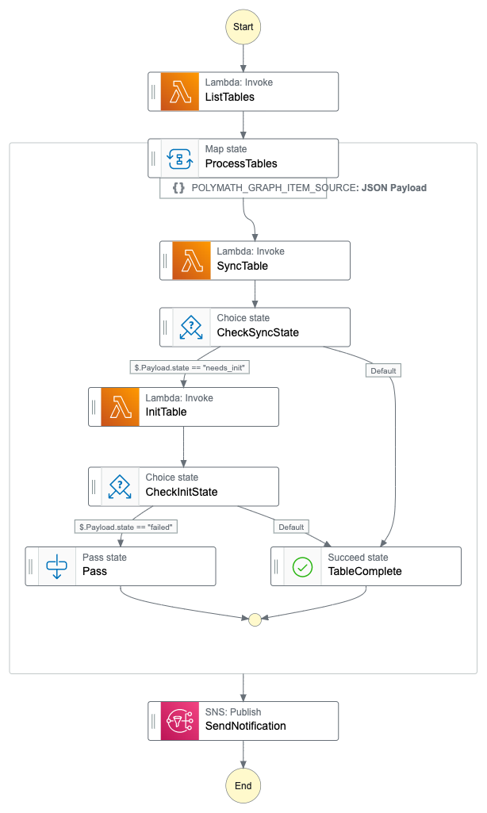

# canvas-data-2-aws - WORK IN PROGRESS

This project contains source code and supporting files for a serverless application that you can use to download and maintain a Canvas Data 2 replica database.
You can deploy this application to your AWS account with the SAM CLI. It includes the following files and folders.

- `list_tables` - Code for a Lambda function that fetches the list of CD2 tables using the `dap` client library.
- `sync_table` - Code for a Lambda function that syncs a table using the `dap` client library.
- `init_table` - Code for a Lambda function that inits a table using the `dap` client library.
- `template.yaml` - A template that defines the application's AWS resources.

This application targets version 2.x of the `instructure-dap-client` library. Version 2 changed the
client API in ways that are not backward compatible with 1.x, so the Lambda functions here follow the
same call sequence the `dap` CLI itself uses (`version_upgrade()` followed by
`execute_operation_on_tables()`), and handle the `ExceptionGroup`s that the 2.x client raises.

**This is a reference implementation.** It deploys and runs as-is, but it makes deliberately simple
choices that you will most likely want to revisit before using it with real data — see
[Adapting this for your own environment](#adapting-this-for-your-own-environment).

This application uses an AWS Step Function to orchestrate the workflow:



## Application workflow

1. The Step Function is executed on an hourly schedule via EventBridge.
2. The first step executes the `list_tables` Lambda functions which retrieves the list of CD2 tables from the API.
3. The list of tables is passed to a `Map` step which executes the following steps for each item in the list:
   1. The `sync_table` Lambda function is executed. It returns one of `complete`, `needs_init` (the table doesn't exist in the database yet), `needs_ddl_update` (a schema change could not be applied), or `failed`.
   2. The output of `sync_table` is checked. If the table synced, the iteration is complete. If `needs_init` was returned, the `init_table` function is executed. Anything else ends the iteration as a failure.
   3. If executed, the output of `init_table` is checked; `failed` ends the iteration as a failure, anything else as a success.
4. Once all iterations are complete, a notification is sent to an SNS topic summarizing which tables completed and which failed.

## Prerequisites

It will be helpful to have a working knowledge of AWS services and the AWS Console. Before you can deploy the application you will need to have the following available:
* A VPC
* One or more subnets where the Lambda functions can be deployed
* One or more subnets where the database cluster can be deployed (can be the same as the Lambda subnets)
* **Outbound internet access from the Lambda subnets** — see below

### Network access for the Lambda functions

The Lambda functions are attached to your VPC so that they can reach the database, and a
VPC-attached Lambda has no internet access by default. The functions need to reach three things:

| Destination | Why | How to provide it |
| --- | --- | --- |
| `api-gateway.instructure.com` | The DAP API — where the data comes from | **NAT gateway (or equivalent egress).** There is no VPC endpoint for a third-party service. |
| AWS Secrets Manager | Reading the database user credential | NAT gateway, or a [Secrets Manager interface endpoint](https://docs.aws.amazon.com/secretsmanager/latest/userguide/vpc-endpoint-overview.html) |
| AWS SSM Parameter Store | Reading the DAP client ID and secret | NAT gateway, or [VPC endpoints for Systems Manager](https://docs.aws.amazon.com/systems-manager/latest/userguide/setup-create-vpc.html#sysman-setting-up-vpc-create) |

**A NAT gateway is effectively required**, because the DAP API is a public endpoint that no VPC
endpoint can reach. Once you have one, the Secrets Manager and SSM interface endpoints become
optional — they only keep that traffic off the public internet. Without egress, the functions
will simply time out.

The functions also have X-Ray tracing enabled, which needs the same outbound access (or an
X-Ray VPC endpoint).

By default the database will not have a public IP address and will not be accessible outside of your VPC. You will need to configure network access to the database as appropriate for your situation.

## Deploying the application

The Serverless Application Model Command Line Interface (SAM CLI) is an extension of the AWS CLI that adds functionality for building and testing Lambda applications. It uses Docker to run your functions in an Amazon Linux environment that matches Lambda. It can also emulate your application's build environment and API.

To use the SAM CLI to deploy this application, you need the following tools.

* SAM CLI - [Install the SAM CLI](https://docs.aws.amazon.com/serverless-application-model/latest/developerguide/serverless-sam-cli-install.html)
* [Python 3 installed](https://www.python.org/downloads/)
* [Docker](https://docs.docker.com/get-docker/) - required, see below

Docker is required because these functions depend on packages with compiled C extensions
(`asyncpg`, `tsv2py`, `aiohttp`). A plain `sam build` installs wheels built for *your* machine,
which produces a deployment package that fails at runtime whenever your platform differs from the
Lambda runtime. `samconfig.toml` therefore sets `use_container = true`, so `sam build` compiles
inside the Lambda-matching container image. If you invoke `sam build` without the config file,
pass `--use-container` explicitly.

The functions are configured for `x86_64`. You can switch them to `arm64` (cheaper and faster on
Graviton) by changing the three `Architectures` entries in `template.yaml`; note that `tsv2py`
publishes no `linux-aarch64` wheels as of 0.8.0, so an arm64 build compiles it from source and
takes longer. Building for an architecture that differs from your host works but runs under
emulation, which is slow.

To build and deploy your application for the first time, run the following in your shell:

```bash
sam build
sam deploy --guided
```

The first command will build the source of your application. The second command will package and deploy your application to AWS, with a series of prompts:

* **Stack Name**: The name of the stack to deploy to CloudFormation. This should be unique to your account and region, and a good starting point would be something matching your project name.
* **AWS Region**: The AWS region you want to deploy your app to.
* **Confirm changes before deploy**: If set to yes, any change sets will be shown to you before execution for manual review. If set to no, the AWS SAM CLI will automatically deploy application changes.
* **Allow SAM CLI IAM role creation**: Many AWS SAM templates, including this example, create AWS IAM roles required for the AWS Lambda function(s) included to access AWS services. By default, these are scoped down to minimum required permissions. To deploy an AWS CloudFormation stack which creates or modifies IAM roles, the `CAPABILITY_IAM` value for `capabilities` must be provided. If permission isn't provided through this prompt, to deploy this example you must explicitly pass `--capabilities CAPABILITY_IAM` to the `sam deploy` command.
* **Save arguments to samconfig.toml**: If set to yes, your choices will be saved to a configuration file inside the project, so that in the future you can just re-run `sam deploy` without parameters to deploy changes to your application.

### Template parameters

Beyond the VPC and subnet parameters, the template takes:

| Parameter | Default | Purpose |
| --- | --- | --- |
| `EngineVersionParameter` | `16.14` | Aurora PostgreSQL engine version (16.3 or later) |
| `MapMaxConcurrencyParameter` | `10` | How many tables to sync concurrently |
| `DatabaseMinCapacityParameter` | `0.5` | Minimum Aurora Serverless v2 capacity (ACU) |
| `DatabaseMaxCapacityParameter` | `4` | Maximum Aurora Serverless v2 capacity (ACU) |
| `LogRetentionInDaysParameter` | `30` | CloudWatch log retention |
| `SkipTablesParameter` | — | Comma-separated list of tables to skip |

The `dap` client supports **PostgreSQL 16.3 and later**. It does not verify this at runtime, so
pairing it with an older engine fails in obscure ways rather than reporting a clear error — don't
lower `EngineVersionParameter` below that.

AWS retires pinned Aurora minor versions over time, so if stack creation fails complaining about
the engine version, pick a currently available one:

```bash
aws rds describe-db-engine-versions --engine aurora-postgresql \
  --query 'DBEngineVersions[].EngineVersion' --output text
```

**Concurrency and database capacity are linked.** Each concurrent table sync opens its own
connection, and Aurora Serverless v2 scales `max_connections` with ACU capacity. The defaults are
deliberately conservative because the first run is the heaviest — every table needs to be
initialized at once against a cluster sitting at its minimum capacity. If you see connection
errors, either lower `MapMaxConcurrencyParameter` or raise `DatabaseMinCapacityParameter`. Note
that raising the minimum capacity raises your continuous cost, since it is the floor you pay for
whether or not the workflow is running.

## Preparing the database

Deploying this application will create an AWS Aurora Postgres cluster. A database user credential is also created and stored in AWS Secrets Manager. In order for the application to use that credential to connect to the database,
a Postgresql user must be created and granted appropriate privileges. A helper script is included that will take care of this setup. After deploying the SAM app, run this script:
```
./prepare_aurora_db.py --stack-name <stack name returned by the SAM deployment>
```
Occasionally the schema for a CD2 table will change. The DAP library applies these changes automatically with `ALTER TABLE`, and this application does nothing special to accommodate them.

Note that PostgreSQL refuses to `ALTER TABLE` while a view depends on the table. This application creates no views, so it should not come up — but if you add your own views over the replicated tables, a CD2 schema change will start failing. `sync_table` reports that case as `needs_ddl_update` and the table is listed under `failed_ddl_update` in the SNS notification; you would need to drop the dependent views and re-run the workflow. If you want that handled automatically, the `deps_save_and_drop_dependencies` / `deps_restore_dependencies` functions from https://github.com/rvkulikov/pg-deps-management are one way to do it.

## Monitoring

The workflow publishes a summary to the `WorkflowNotificationTopic` SNS topic at the end of every
run, listing which tables completed and which failed. Subscribe to that topic to receive them.

Because that notification is sent on every run whether or not anything went wrong, a CloudWatch
alarm (`cd2-<environment>-workflow-failed`) also publishes to the same topic when a Step Functions
execution actually fails, so real failures are distinguishable from the routine summaries.

Step Functions execution history is logged to `/aws/vendedlogs/states/cd2-<environment>-refresh`,
and each Lambda function logs to `/aws/lambda/cd2-<environment>-<function>`. All of these use the
retention set by `LogRetentionInDaysParameter`; note that Lambda's default log groups never expire,
which is why the template declares them explicitly. X-Ray tracing is enabled on the functions and
the state machine.

## Configuration

In order for the application to use the DAP API, you will need to provide a client ID and secret.

The application uses AWS SSM Param Store to securely these values and retrieve them at runtime. To store your client ID and secret:
```
aws ssm put-parameter --name '/<environment>/canvas_data_2/dap_client_id' --type SecureString --value '<your client ID>'
aws ssm put-parameter --name '/<environment>/canvas_data_2/dap_client_secret' --type SecureString --value '<your client secret>'
```
where `<environment>` is either `dev` or `prod`. You can also use the AWS SSM console to manage the parameter.

## Running the application

By default the workflow that synchronizes the database will run every three hours. You can also run the workflow manually via the AWS Console: navigate to the Step Functions console, find your `CD2RefreshStateMachine` in the list, and click the `Start execution` button.

This application uses AWS Lambda to run the `init` and `sync` steps for each CD2 table. If the `init` or `sync` step for any given table takes longer than 15 minutes (the limit on how long Lambda functions can run), the workflow will fail. You will be able to see the error in the AWS Step Functions console. If this happens, you'll need to perform the first initialization for the problematic table manually using the DAP client.

TODO: details on how to initialize a table using the DAP client

## Adapting this for your own environment

This is a reference implementation. It deploys and works as-is, but it makes choices that suit a
demonstration rather than any particular institution's production environment. The areas below are
the ones most likely to need attention, roughly in the order they tend to matter.

### Assumptions baked into the design

* **One Canvas instance, one database, one schema.** The functions read a single pair of DAP
  credentials from a fixed SSM path and replicate the `canvas` namespace into a single database.
  Replicating multiple Canvas instances, or several tenants into separate schemas, means threading
  a database/tenant identifier through the Step Function payload and the SSM parameter paths.
* **No views over the replicated tables.** See the note under *Preparing the database* — adding your
  own views changes how CD2 schema changes behave.
* **Two environments, `dev` and `prod`,** defined in `samconfig.toml` and enforced by
  `EnvironmentParameter`'s allowed values. Add more there if you need them.

### Security

Security hardening is deliberately minimal here so the template stays readable. Before running this
with real data, consider:

* **KMS key**: no automatic rotation, no alias, and the default key policy. Consider
  `EnableKeyRotation`, and an explicit key policy scoped to the roles that actually need the key.
* **Only the secrets are encrypted.** The database credentials use the stack's KMS key. The log
  groups and the SNS topic are not encrypted; they carry table names, row counts and error messages
  rather than Canvas data itself. Extending encryption to them is left as an exercise — note that it
  needs key policy grants for the CloudWatch Logs and CloudWatch Alarms service principals, since
  CloudWatch Logs encrypts through its own service principal rather than the writing role, and an
  alarm that cannot use the key stops notifying with an error that appears only in its alarm history.
* **Security groups**: no egress rules are declared, so EC2's default allow-all egress applies. The
  database security group also has a `TODO` for whatever ingress your own analysts or BI tools need.
* **`DeletionProtection` is `false`** on the database cluster, which is convenient for a
  proof-of-concept and wrong for anything you care about. Note that `AWS::RDS::DBCluster` defaults
  to `DeletionPolicy: Snapshot`, so a stack deletion does leave a final snapshot behind.
* **Secrets are never rotated.** The database user credential is generated once at deploy time.
* **The RDS Data API is enabled** (`EnableHttpEndpoint: true`) because `prepare_aurora_db.py` uses
  it to create the database user. It is IAM-gated, but it is an additional path to the database. If
  you provision the database user some other way, you can turn it off.

### Networking and cost

* **A NAT gateway is required** (see *Network access for the Lambda functions*) and is usually the
  largest fixed cost in this stack — frequently more than the database itself at low usage.
* **Aurora Serverless v2 minimum capacity is a continuous charge**, not a ceiling. Raising
  `DatabaseMinCapacityParameter` to fix connection pressure raises your bill around the clock.
* **Interface endpoints for Secrets Manager and SSM** are optional once NAT exists, and each carries
  its own hourly charge. They are worth it if you want that traffic off the public internet.
* **Log retention** defaults to 30 days. Verbose DAP output across many tables adds up.

### Sizing and limits

* **Lambda's 15-minute ceiling** applies to each table's init and sync. Very large tables — the
  submissions-related ones are the usual culprits — can exceed it, in which case that table needs to
  be initialized out-of-band with the `dap` CLI. This is the most likely reason to outgrow this
  architecture entirely and move the work to ECS or Batch.
* **`MapMaxConcurrencyParameter` and `DatabaseMinCapacityParameter` are coupled.** See *Template
  parameters*.
* **Function memory** (`MemorySize`) was chosen by rough estimate, not measurement. Init runs at
  8192 MB largely to get proportional CPU. Measure before assuming these are right for your data.
* **The schedule is every three hours.** CD2 data is not real-time, so syncing more often mostly
  costs money; syncing less often risks longer, heavier incremental syncs.

### Build and deployment

* **`x86_64` versus `arm64`** — see the note under *Deploying the application*.
* **Resource names are prefixed `cd2-`.** If you deploy more than one instance of this stack into an
  account, those names will collide; add your own distinguishing prefix.
* **The stack exports the cluster and admin secret ARNs.** If nothing consumes them, you can drop
  the exports; if something does, be aware that renaming them later will block stack updates.
* **There is no CI.** Consider running `sam validate --lint`, `ruff check`, and `sam build` on pull
  requests.

## Cleanup

To delete the application that you created, use the AWS CLI. Assuming you used your project name for the stack name, you can run the following:

```bash
aws cloudformation delete-stack --stack-name canvas-data-2
```

Alternatively, you can delete the stack in the CloudFormation console (within the AWS web console).
